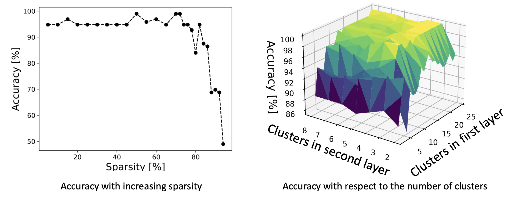
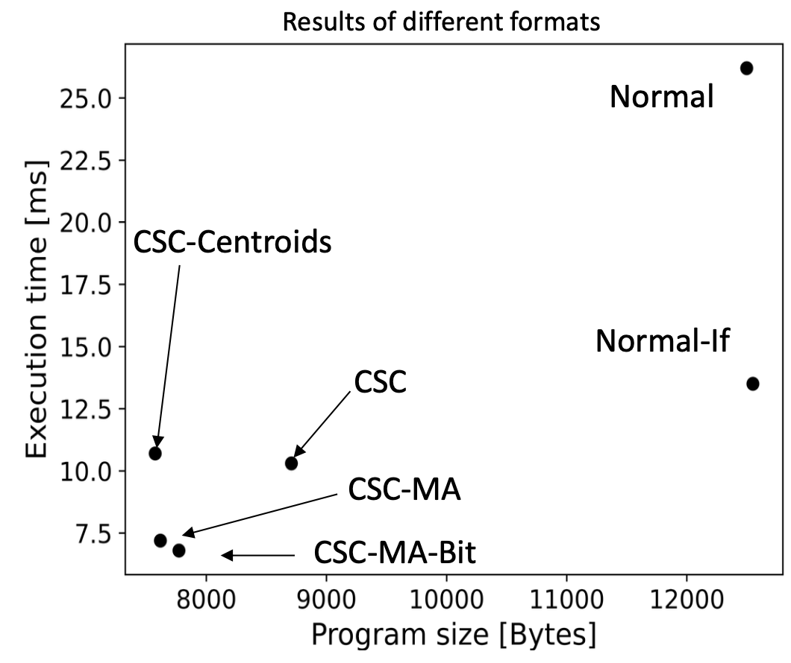
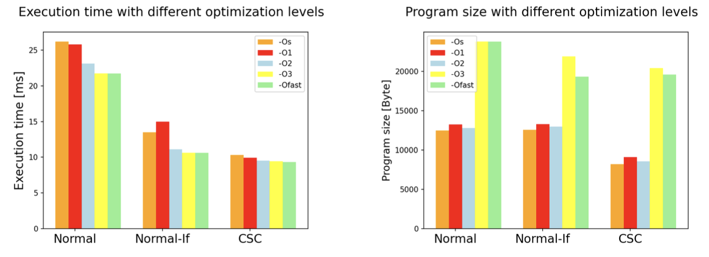

### Compression of Artificial Neural Networks for Hand Gesture Recognition
Neural networks have emerged as a versatile tool for solving problems across various domains. This project utilizes a two-layer networks to recognize hand gestures using a $3 \times 3$ camera setup. Due to hardware restrictions of the camera's Arduino microcontroller, the trained neural networks cannot fit in the memory in the first place and inference would take very long. To address this, we will also explore different strategies for compressing the neural network and storing it on the microcontroller.

<table>
  <tr>
    <td align="center"> Left-to-right and right-to-left gestures as seen by the camera</td>
  </tr>
</table>

## Compression
To reduce the number of parameters that need to be saved, connections are pruned and the remaining parameters are quantized. The impact of pruning is negligible until 70% of the weights get pruned. The number of clusters in the second layer barely matters while the number of clusters in the first layer is highly important for the classification accuracy.

## Execution
To execute this neural network on the Arduino, different ways of storing the weight matrices were tested. The Compressed Sparse Column (CSC) based methods were fastest and required the least amount of memory.

## Compilation
Execution can be accelerated using compiler flags. This is at the expense of memory size. As a compromise, -O2 was chosen
